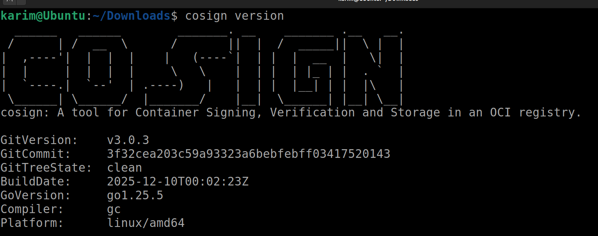
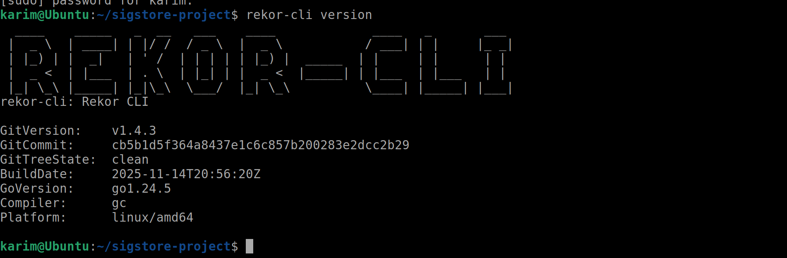
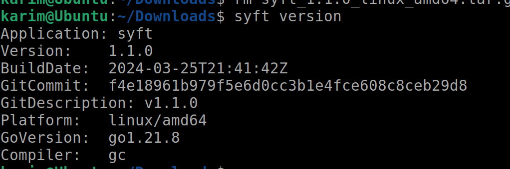
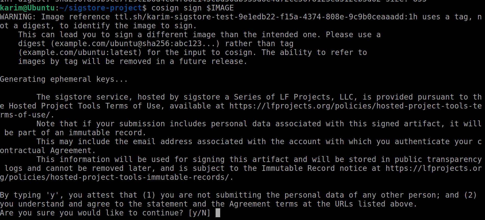
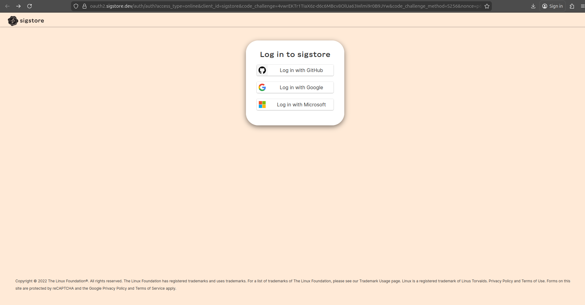
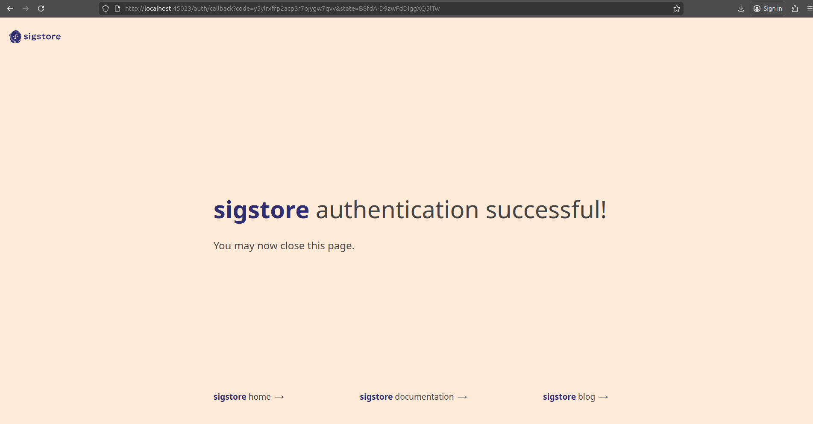
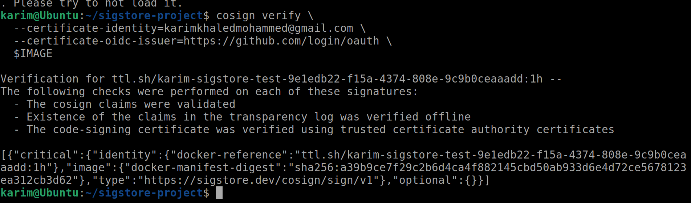
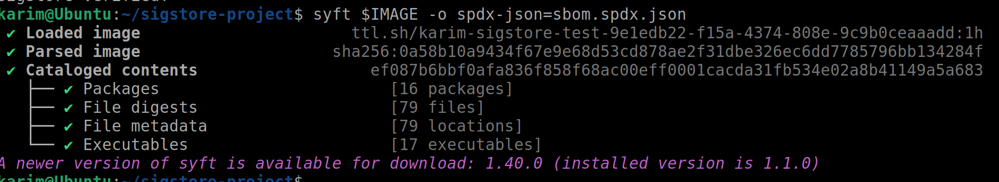
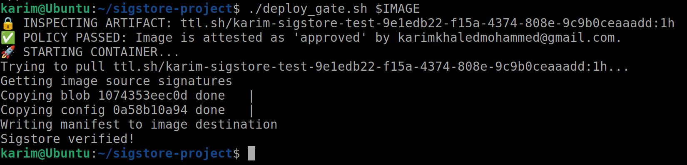

# End-to-End Supply Chain Security with Sigstore

**Author:** Karim  
**Status:** Complete  
**Objective:** To implement a "Keyless" signing workflow, attach Software Bill of Materials (SBOM) attestations, and enforce deployment policies using a custom admission gate.

---

## 🛠 Tools Used
* **Podman:** Container creation and management.
* **Cosign:** Signing and verification (Sigstore).
* **Rekor:** Public transparency log.
* **Syft:** SBOM generation (Software Bill of Materials).
* **Bash & jq:** Scripting and JSON parsing.

---

## Prerequisites & Installation

### Install Sigstore Tools
```bash
# Install Cosign (Sigstore client for signing and verification)
curl -Lo /usr/local/bin/cosign https://github.com/sigstore/cosign/releases/latest/download/cosign-linux-amd64
chmod +x /usr/local/bin/cosign

# Install Rekor CLI (Transparency log client)
curl -Lo /usr/local/bin/rekor-cli https://github.com/sigstore/rekor/releases/latest/download/rekor-cli-linux-amd64
chmod +x /usr/local/bin/rekor-cli
```

### Install Syft (SBOM Generation)
```bash
# Install Syft for Software Bill of Materials generation
curl -sSfL https://raw.githubusercontent.com/anchore/syft/main/install.sh | sh -s -- -b /usr/local/bin
```

### Install Additional Dependencies
```bash
# Install Podman (Container management)
sudo apt-get update
sudo apt-get install -y podman

# Install jq (JSON parser)
sudo apt-get install -y jq
```

### Verify Installation
```bash
cosign version
rekor-cli version
syft version
podman version
```
### cosign Version



### Rekor CLI Version


### Syft Version


---

## 2. The Architecture
This project leverages the three pillars of the Sigstore project to secure the software supply chain:

1.  **Fulcio (The Certificate Authority):**
    * *Traditional:* Long-lived private keys stored on a laptop (High risk).
    * *Sigstore:* Fulcio issues a short-lived x509 certificate based on **OIDC Identity** (Gmail/GitHub). It is valid for only ~10 minutes, eliminating key management headaches.

2.  **Rekor (The Transparency Log):**
    * A public, append-only ledger (similar to a blockchain) that records every signature. This guarantees immutability and prevents secret tampering.

3.  **Cosign (The Client):**
    * The orchestration tool that manages the interactions between the artifacts, Fulcio, and Rekor.

---

## 3. Environment Setup & Artifact Creation
We utilize an ephemeral registry (`ttl.sh`) to simulate a container registry without complex authentication overhead.

### Commands
```bash
# 1. Define a unique image name using a UUID to prevent collisions
export IMAGE=ttl.sh/karim-sigstore-test-$(uuidgen):1h

# 2. Create a minimal Dockerfile
echo "FROM alpine" > Dockerfile
echo "CMD ['echo', 'Sigstore verified!']" >> Dockerfile

# 3. Build the container image using Podman
podman build -t $IMAGE .

# 4. Push the image to the public registry
podman push $IMAGE
```

---

## 4. Keyless Signing (The "Fulcio" Step)

We sign the image using an OIDC identity rather than a static private key.

### Commands
```bash
cosign sign $IMAGE
```

**Note:** This triggers a browser login flow (Google/GitHub) to prove identity.

### What happens?

* **Identity:** User authenticates via OIDC.
* **Cert:** Fulcio issues a temporary certificate.
* **Sign:** Cosign signs the image hash.
* **Log:** The signature is recorded in Rekor.

### Cosign Sign Execution


### Sigstore Login Options


### Successful Authentication



### Cosign Verify Output



---

## 5. Transparency Log Inspection (The "Rekor" Step)

Verification that the signature was publicly recorded and is immutable.

### Commands
```bash
# 1. Search the log for entries related to your email
rekor-cli search --email karimkhaledmohammed@gmail.com

# 2. Inspect a specific entry (using the UUID from the search)
rekor-cli get --uuid <UUID_FROM_SEARCH>
```


---

## 6. Attestations & SBOMs (The "Syft" Step)

Signing proves who built the software. Attestations prove what is inside it.

### Commands
```bash
# 1. Generate the SBOM in SPDX JSON format
# Note: We use local image source to prevent network registry issues
syft podman:$IMAGE -o spdx-json=sbom.spdx.json --quiet

# 2. Attest (Sign and Attach) the SBOM to the image
cosign attest --predicate sbom.spdx.json --type spdx $IMAGE
```

### Syft SBOM Generation



---

## 7. Verification (The Consumer Step)

The standard verification process a user or system performs before running the software.

### Commands
```bash
cosign verify-attestation \
  --certificate-identity=karimkhaledmohammed@gmail.com \
  --certificate-oidc-issuer=https://github.com/login/oauth \
  --type spdx \
  $IMAGE
```

**Note:** Change issuer to `https://accounts.google.com` if using google login.


---

## 8. Policy Enforcement (The Gatekeeper)

A custom Bash script acting as a "Deployment Gate" (simulating a Kubernetes Admission Controller).

### The Script: deploy_gate.sh
```bash
#!/bin/bash
IMAGE=$1
EMAIL="karimkhaledmohammed@gmail.com"
ISSUER="https://accounts.google.com" 

# Verify attestation and extract status/data
OUTPUT=$(cosign verify-attestation \
    --certificate-identity=$EMAIL \
    --certificate-oidc-issuer=$ISSUER \
    --type spdx \
    $IMAGE 2>/dev/null | jq -r '.payload | @base64d | fromjson | .predicate')

if [[ -n "$OUTPUT" ]]; then
    echo "✅ POLICY PASSED: Valid SBOM found from $EMAIL."
    podman run --rm $IMAGE
else
    echo "❌ POLICY FAILED: No valid attestation found."
    exit 1
fi
```

### Deployment Gate Execution


---

## 9. Skills Demonstrated

* **Supply Chain Security:** SLSA Level 2/3 compliance concepts.
* **Keyless Infrastructure:** Removing the risk of long-lived private keys.
* **SBOM Management:** Generating and attaching software inventories.
* **Policy as Code:** Automated enforcement of security rules before runtime.
